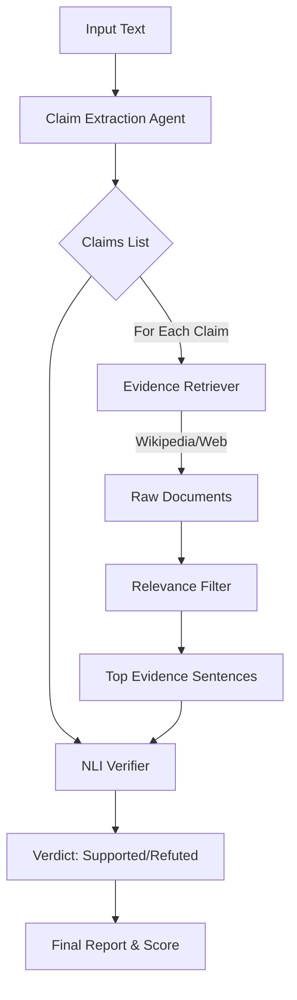

# Architecture Overview

The **LLM Hallucination Detector** operates as a multi-stage pipeline designed to fact-check generated text against external knowledge sources.

## Pipeline Stages

### 1. Claim Extraction (Atomic decomposition)
**Goal:** Break down a complex LLM response into atomic, verifiable facts.

- **Input:** Raw LLM output (e.g., "The Eiffel Tower was built in 1889 by Gustave Eiffel in Berlin.")
- **Process:** We use `Gemini Pro/Flash` with a strict prompt to split complex sentences into independent claims.
- **Output:** List of claims:
  1. "The Eiffel Tower was built in 1889."
  2. "The Eiffel Tower was built by Gustave Eiffel."
  3. "The Eiffel Tower is located in Berlin."

### 2. Evidence Retrieval (Grounding)
**Goal:** Find external sources that prove or disprove each claim.

- **Primary Source:** **Wikipedia API**. The system identifies entities in the claim (e.g., "Eiffel Tower") and fetches relevant pages.
- **Secondary Source (Fallback):** **Google Custom Search (SerpAPI)**. If Wikipedia yields no results or low relevance scores, the system performs a live web search.
- **Filtering:** Retrieved documents are chunked into sentences. We calculate a relevance score (TF-IDF / Keyword Overlap) and keep the top $N$ most relevant sentences.

### 3. Claim Verification (NLI)
**Goal:** Determine if the retrieved evidence supports the claim.

- **Model:** A Cross-Encoder NLI model (`roberta-large-mnli`).
- **Logic:** The model takes pairs of `(Claim, Evidence)` and outputs probabilities for three classes:
    1. **Entailment** (Evidence proves claim)
    2. **Contradiction** (Evidence disproves claim)
    3. **Neutral** (Unrelated)
- **Aggregation:** 
    - If *any* strong evidence contradicts the claim → **Refuted** (Hallucination).
    - If strong evidence supports it and none contradicts → **Supported**.
    - Otherwise → **Not Enough Info**.

## Data Flow Diagram

